# Introducción a Maven, GIT, GitHub
## Descripción:
Este repositorio contiene la implementación de un taller introductorio sobre herramientas esenciales para el desarrollo de software: **Maven**, **Git** y **GitHub**. El taller enseña cómo utilizar estas herramientas para automatizar la construcción de proyectos, gestionar versiones de código y facilitar la colaboración en equipo. Las instrucciones están disponibles en el archivo `src/site/resources/Lab1-Intro-Maven-Git-GitHub.pdf`.

### Herramientas:

1.  **Maven**: Herramienta de automatización de construcción que gestiona el ciclo de vida del proyecto y las dependencias en proyectos Java, asegurando consistencia y eficiencia.
    
2.  **Git**: Sistema de control de versiones distribuido que permite a los desarrolladores gestionar cambios en el código de manera eficiente y colaborar sin conflictos.
    
3.  **GitHub**: Plataforma en línea basada en Git que facilita la colaboración, el almacenamiento y la gestión de proyectos de software, permitiendo a los desarrolladores trabajar juntos de manera más eficiente.

### Verificando versión de maven
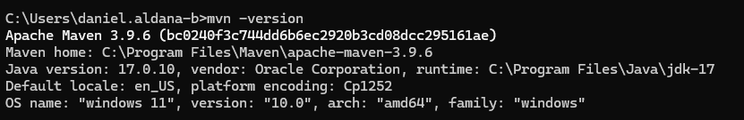
### Verificando versión de java
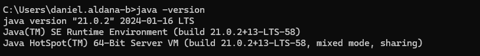
### Creando proyecto
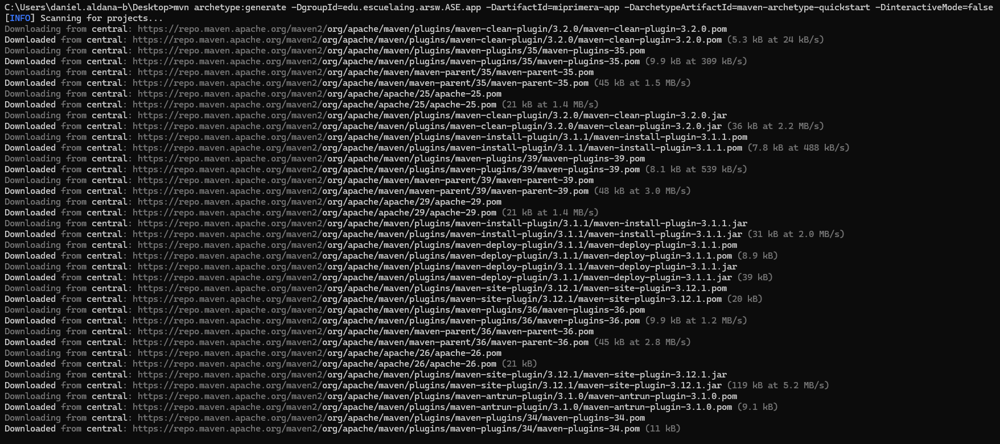
### Estructura de archivos
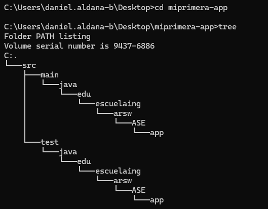
### Configuración pom.xml
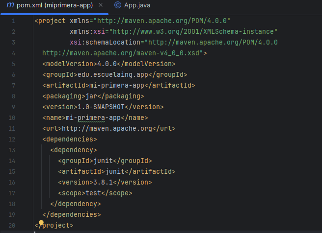
### mvn package
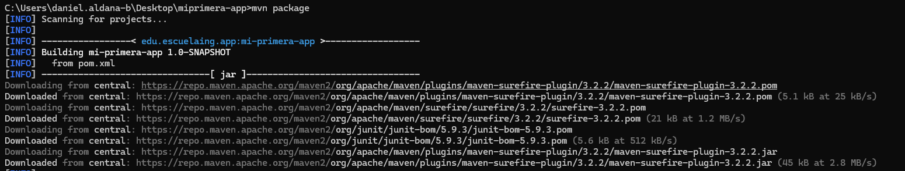
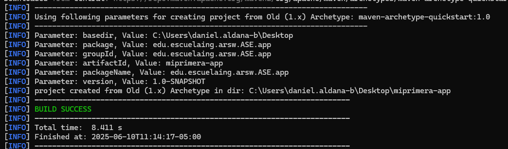
### Ejecución
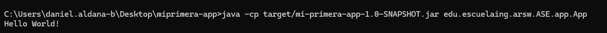
### Javadoc
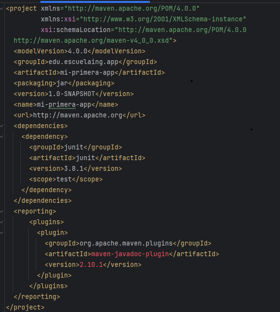
### Comandos para documentación
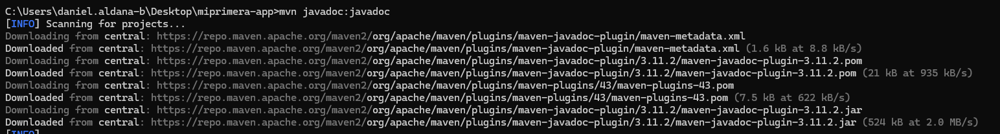
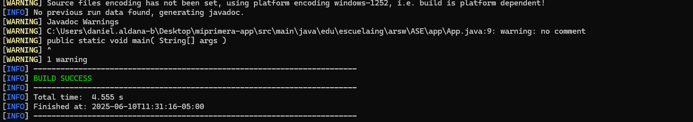
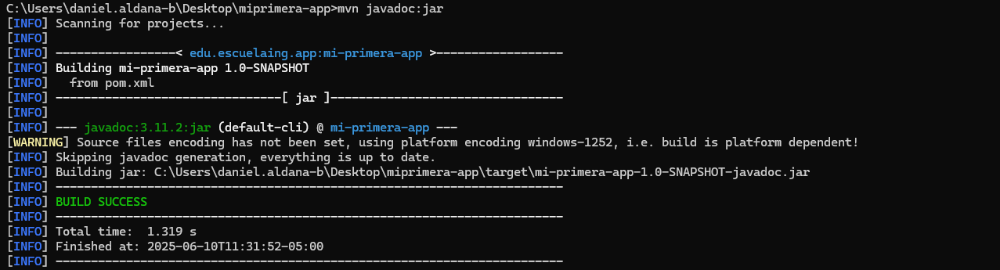
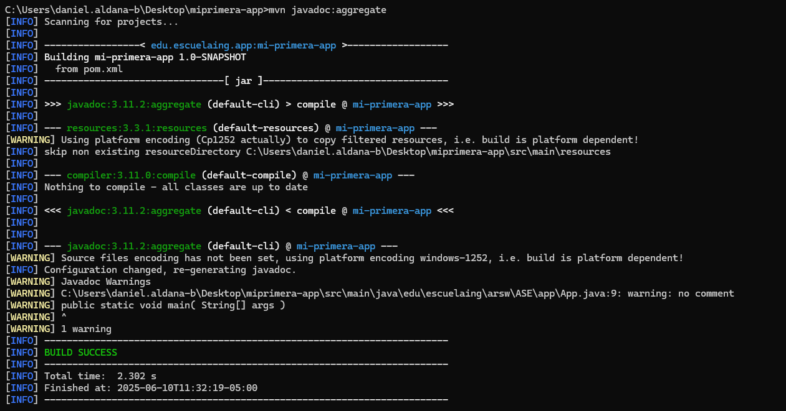
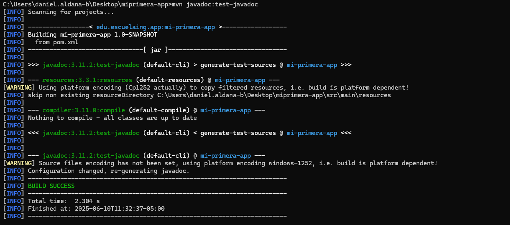
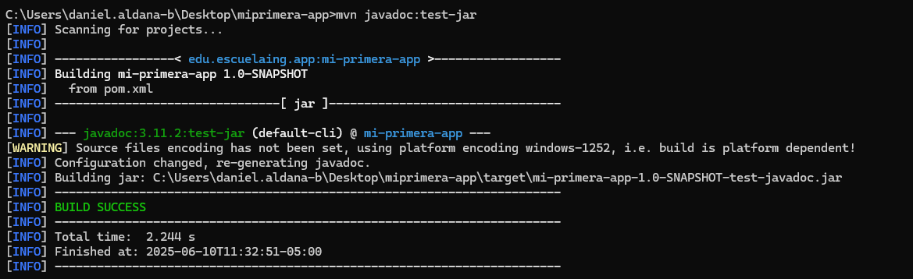
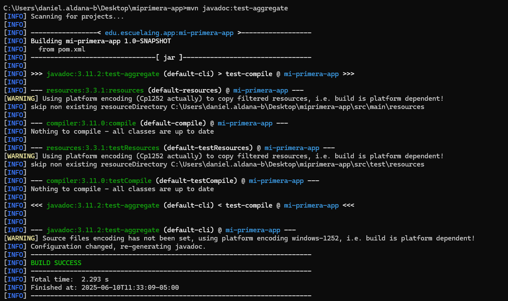
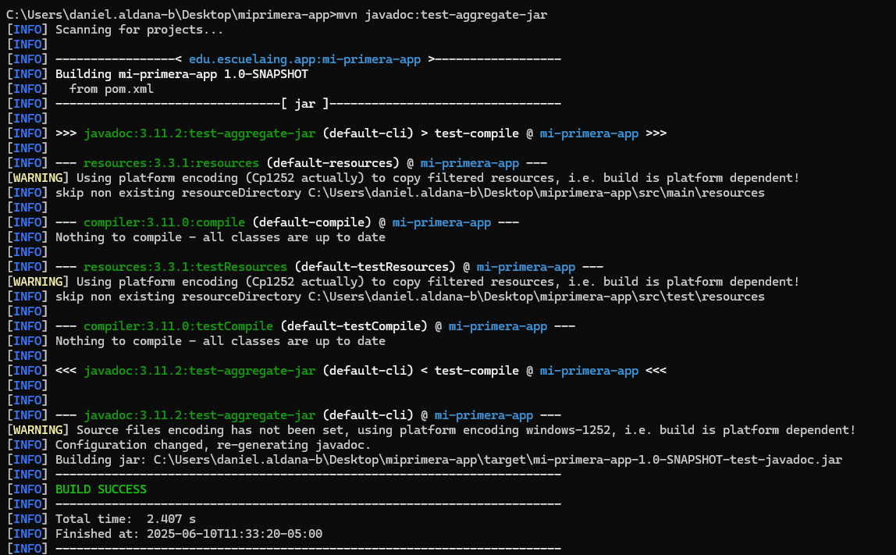
### Configuracion de identidad
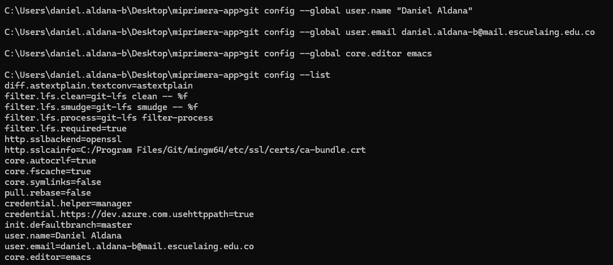
### commandos inciales
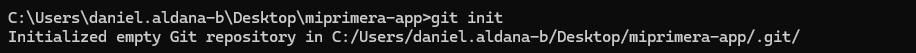
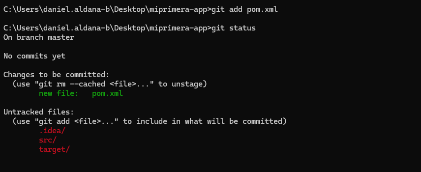
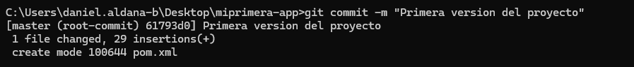
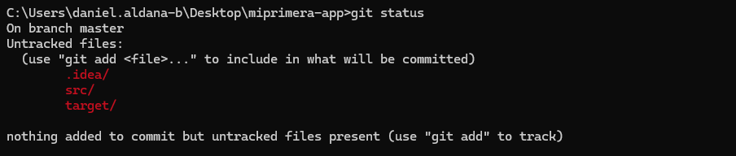

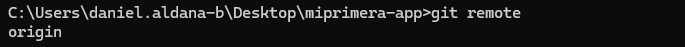
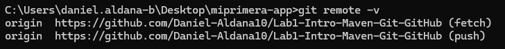
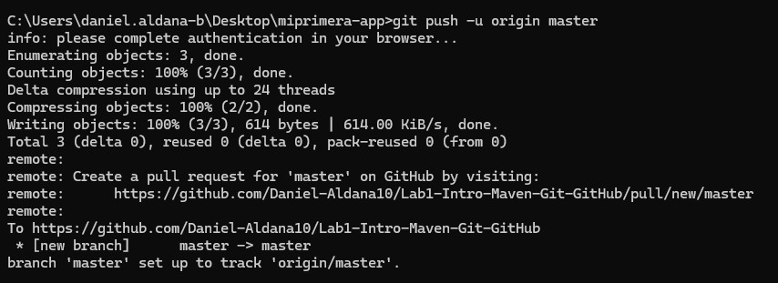
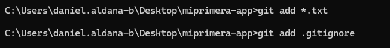
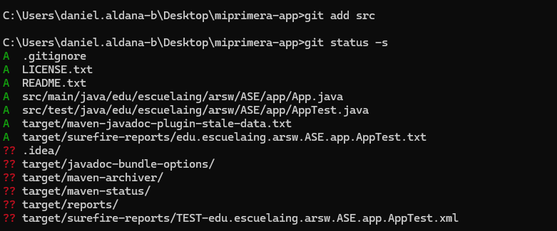
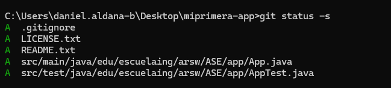
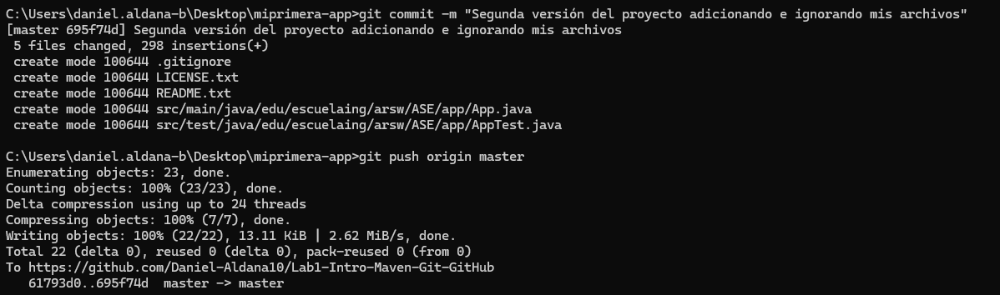
### Clonando el proyecto
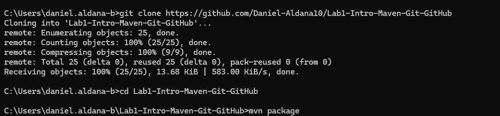
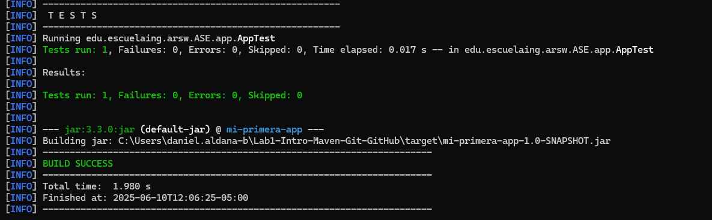
### Creando la estructura de la tarea y el repositorio remoto
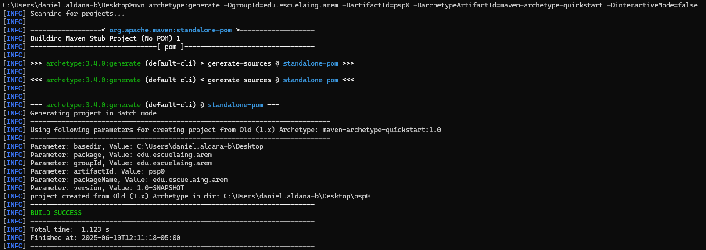
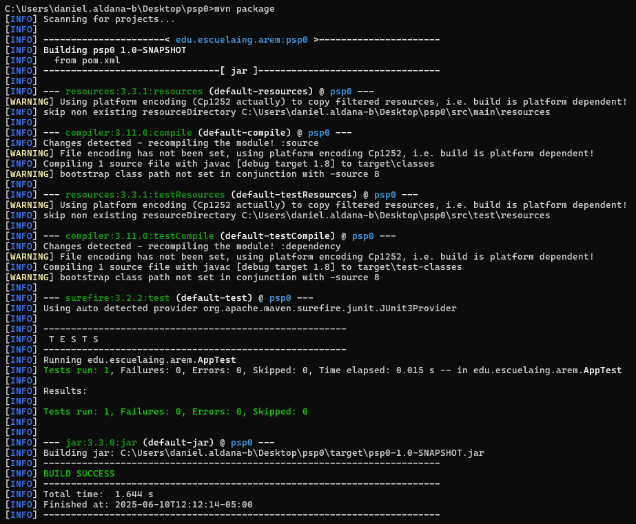
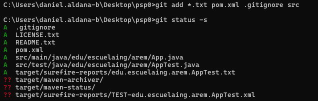
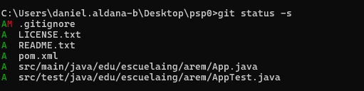
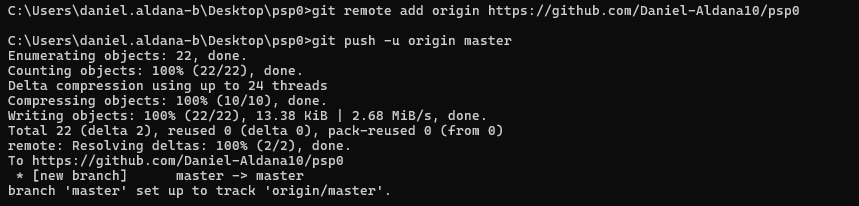